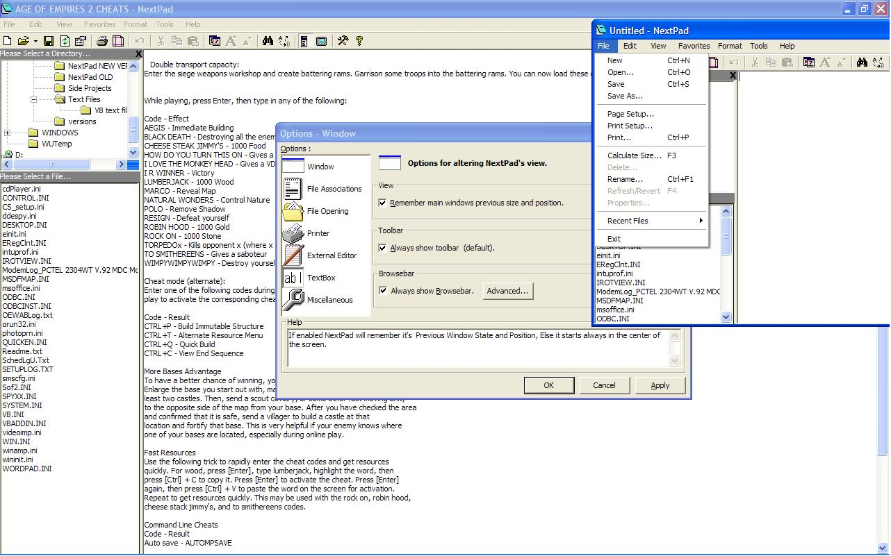



## NextPad \*Awesome text editor\* FIXED corrupt page

### Description

Features : Since Version The First Version To This Version

* Word wrap ,

* Clipboard Options ,

* Can Launch Another Editor If The File That Is Being attempted too be opened is too large ,

* has an Options dialog

* Can Be Used on the command Line and ,

* Can Be the Default text Viewer for (*.TXT) Files......

* Set Font

* Find Dialog

* AUTHENTIC windows core component Properties dialog , Strait From the windows API !!!!

* Launch New instance , Through A menu or dialog

* Has a Toolbar , COOLBAR

* Has A Clipboard Viewer , Editor

* Full screen Mode

* Recent File Menu

* Undo Option Added

* Option Too Alter NextPad's Thread Process Priority

* Option For NextPad Not Too ask Too Launch External Editor , Just Launch it.

* Better Toolbar Now it's a CoolBar

* Better Launching of a New instance Because Now you can add command line parameters

* NextPad Now Has An Option Too Remember Previous window Position And Window state

* You Can Now Set The Back Color And Forecolor Of the TextBoxes

* Better Text File Manager

* Able Too Move File

* Ability too Choose open File Method , Binary , Input

* Smart File Opening Which Is Smart Because it detects which File Method to open the file with

* Windows Can Stay On Top

* Ability Too Print Documents In NextPad Or The Text File Manager , In Color Or In Black And White

* Replace Dialog

* Text File Manager Has Options

* Text File Manager Can Delete A File , Or Send it too the Recycle bin

* Text File Manager Can Shell The Document Opening it with The Program associated with the file

* Text File Manager Uses Smart File Opening

* You Can Now Set The Font For The Text File Manager

* NextPad Has A Tip Of The Day Dialog

* NextPad has a file Browse Bar

* AND SO MUCH MORE NOT LISTED !!!

* Better recent files menu, no more limit etc...

* Added favorites menu.

* Fixed bug where you couldnt open files larger than 65k in Recent File and

Organize Favorites dialogs.

* Fixed bug that is activated when you click No to a message box asking you

to open a file to large for NextPad to open, (only triggered when opening a file from the command line).

* Made work around for bug where you couldnt set the clipboard text, while using the

vb clipboard object when using the manifest file.

* Existing features that have needed much improvement have been improved

(allowing NextPad to work more efficently).

* Existing code base has been improved.

* Replace dialog has been improved including new replace functions

such as make replacement uppercase, etc.

* Fixed bug where if you had minimized the main window,

then closed it with the "Remember previous window position" option on you could not see

the main window the next time you started NextPad.

* Added new "Insert" menu so you can now insert tab's and new line's into your documents, etc.

* Added new "Make Selection" menu so you can now make the text you have selected

inverted,uppercase,lowercase,etc.

* Updated clipboard window.

* Rename feature added allowing you to rename the file that is currently open.

* Calculate size feature added allowing you to check the size of the document before you save it.

* Refresh\Revert feature added allowing you to refresh the document currently open.

* Manage clipboard dialog has taken the place of the two pointless ones.

* Tip Of The Day dialog has been finally updated.

* Main Toolbar has been revised again to look and feel better when in use.

* Added insert at beginning of document and insert at end of document menu.

* The BrowseBar has been improved nicely, its appearance has been altered slightly also.

* Fixed bug that occured when you dragged a file from explorer onto NextPad's icon, then the file

would not open.

* Add Directory function added to the favorites dialog.

Thanks If You Like It PLEASE Vote Otherwise PLEASE LEAVE YOUR SUGGESTIONS AND

ANY CRITICISM YOU HAVE, PLEASE LEAVE COMMENTS !
 
### More Info
 
Please read all code as some of this code might be different from other vb coders preference.

             |
---                |---
**Submitted On**   |2003-08-27 21:29:56
**By**             |[Jason](https://github.com/Planet-Source-Code/PSCIndex/blob/master/ByAuthor/jason.md)
**Level**          |Advanced
**User Rating**    |4.3 (30 globes from 7 users)
**Compatibility**  |VB 5\.0, VB 6\.0
**Category**       |[Miscellaneous](https://github.com/Planet-Source-Code/PSCIndex/blob/master/ByCategory/miscellaneous__1-1.md)
**World**          |[Visual Basic](https://github.com/Planet-Source-Code/PSCIndex/blob/master/ByWorld/visual-basic.md)
**Archive File**   |[NextPad\_\_A1636878282003\.zip](https://github.com/Planet-Source-Code/jason-nextpad-awesome-text-editor-fixed-corrupt-page__1-48056/archive/master.zip)

### API Declarations

About 15 or so.

